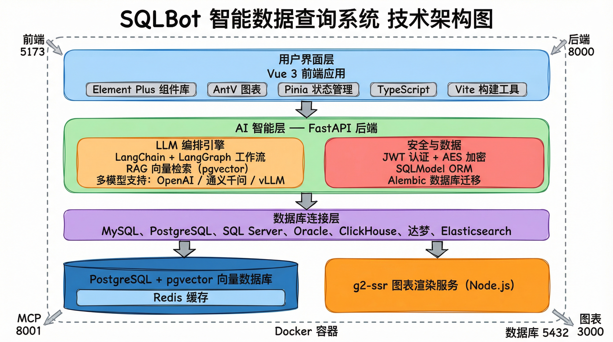

# SQLBot 技术栈详细说明

## 项目定位

**SQLBot** 是一个智能数据查询系统（ChatBI），通过 LLM + RAG（检索增强生成）将自然语言转换为 SQL 查询。当前版本 **v1.6.0**。

---

## 1. 后端 (Python)

### 1.1 核心框架

| 类别 | 技术 | 版本 | 说明 |
|------|------|------|------|
| 语言 | Python | 3.11 | 必须使用 3.11.x |
| Web 框架 | FastAPI | ≥0.115 | 高性能异步框架 |
| ORM | SQLModel | ≥0.0.21 | 基于 SQLAlchemy + Pydantic |
| 数据库迁移 | Alembic | ≥1.12 | 应用启动时自动执行迁移 |
| 数据校验 | Pydantic | >2.0 | 请求/响应模型 |
| 包管理 | uv | — | 快速 Python 包安装器（替代 pip/poetry） |
| 构建系统 | Hatchling | — | PEP 517 构建后端 |

### 1.2 AI / LLM 相关

| 库 | 版本 | 用途 |
|----|------|------|
| LangChain | 0.3.x | LLM 调用抽象层 |
| LangChain-Core | 0.3.x | LangChain 核心组件 |
| LangChain-OpenAI | 0.3.x | OpenAI/Azure 接入 |
| LangChain-Community | 0.3.x | 社区集成 |
| LangChain-HuggingFace | ≥0.2.0 | HuggingFace 嵌入模型集成 |
| LangGraph | 0.3.x | LLM 工作流编排（有向图） |
| LlamaIndex | ≥0.12.35 | 索引与检索框架 |
| sentence-transformers | ≥4.0.2 | 文本嵌入模型加载 |
| DashScope | ≥1.14 | 阿里通义千问 SDK |
| PyTorch | ≥2.7.0 | 模型推理（支持 CPU / CUDA 12.8） |
| pgvector | ≥0.4.1 | PostgreSQL 向量搜索 |

**嵌入模型**：shibing624/text2vec-base-chinese（768 维向量）

### 1.3 数据库连接器

| 数据库 | Python 库 | 版本 |
|--------|-----------|------|
| PostgreSQL | psycopg + psycopg2-binary | ≥3.1 / ≥2.9 |
| MySQL | pymysql | ≥1.1 |
| SQL Server | pymssql | ≥2.3 |
| Oracle | oracledb | ≥3.1 |
| ClickHouse | clickhouse-sqlalchemy | ≥0.3.2 |
| Redshift | redshift-connector | ≥2.1 |
| Elasticsearch | elasticsearch[requests] | ≥7.10, <8.0 |
| 达梦 (DM) | dmpython | 2.5.22（仅 Linux） |

### 1.4 安全与认证

| 库 | 用途 |
|----|------|
| pyjwt | JWT 令牌生成与验证 |
| passlib[bcrypt] + bcrypt | 密码哈希 |
| pycryptodome | AES 加密（数据库凭证） |
| cryptography | TLS/加密基础库 |
| ldap3 | LDAP 目录认证 |

### 1.5 数据处理

| 库 | 用途 |
|----|------|
| pandas | 数据分析与处理 |
| openpyxl | Excel 读写 (.xlsx) |
| xlsxwriter | Excel 写入 |
| xlrd | Excel 读取 (.xls) |
| python-calamine | 高性能 Excel 读取 |
| sqlparse | SQL 解析 |
| sqlglot | SQL 转换与方言适配 |
| tabulate | 表格格式化输出 |
| dicttoxml | 字典转 XML |
| numpy | 数值计算 |

### 1.6 基础设施

| 库 | 用途 |
|----|------|
| httpx | 异步 HTTP 客户端 |
| redis + fastapi-cache2 | 缓存 |
| sentry-sdk[fastapi] | 错误监控与追踪 |
| fastapi-mcp | MCP 协议支持 |
| tenacity | 重试机制 |
| pyyaml | YAML 配置解析 |
| python-multipart | 文件上传 |

### 1.7 代码质量工具（开发依赖）

| 工具 | 用途 |
|------|------|
| ruff | 代码检查 + 格式化（替代 flake8 + black + isort） |
| mypy (strict) | 静态类型检查 |
| pytest | 单元测试 |
| coverage | 测试覆盖率 |
| pre-commit | Git 钩子管理 |

---

## 2. 前端 (Vue.js)

### 2.1 核心框架

| 类别 | 技术 | 版本 | 说明 |
|------|------|------|------|
| 框架 | Vue 3 | ^3.5 | Composition API + `<script setup>` |
| 语言 | TypeScript | ~5.7 | 类型安全 |
| 构建工具 | Vite | ^6.3 | 快速开发与构建 |
| 类型检查 | vue-tsc | ^2.2 | Vue 文件 TypeScript 检查 |
| 状态管理 | Pinia | ^3.0 | Vue 官方状态管理 |
| 路由 | Vue Router | ^4.5 | SPA 路由 |
| HTTP 客户端 | Axios | ^1.8 | API 请求 |
| UI 组件库 | Element Plus | ^2.10 | 主 UI 框架 |
| 国际化 | vue-i18n | ^9.14 | 多语言支持 |

### 2.2 可视化

| 库 | 版本 | 用途 |
|----|------|------|
| @antv/g2 | ^5.3 | 统计图表 |
| @antv/s2 | ^2.4 | 表格 / 透视表 |
| @antv/x6 | ^3.1 | 图编辑 / 流程图 |

### 2.3 编辑器与渲染

| 库 | 用途 |
|----|------|
| TinyMCE ^7.9 + @tinymce/tinymce-vue | 富文本编辑器 |
| highlight.js + @highlightjs/vue-plugin | 代码高亮 |
| markdown-it + github-markdown-css | Markdown 渲染 |
| vue-dompurify-html | XSS 防护 / HTML 净化 |

### 2.4 工具库

| 库 | 用途 |
|----|------|
| lodash / lodash-es | 通用工具函数 |
| dayjs | 日期处理 |
| @vueuse/core | Vue 组合式工具集 |
| html2canvas | HTML 截图 |
| crypto-js | 前端加密 |
| json-bigint | 大整数 JSON 解析 |
| mitt | 事件总线 |
| snowflake-id | 雪花 ID 生成 |
| web-storage-cache | 本地存储缓存 |

### 2.5 开发工具

| 工具 | 用途 |
|------|------|
| ESLint ^9.28 + eslint-plugin-vue | 代码检查 |
| Prettier | 代码格式化 |
| unplugin-auto-import | 自动导入 API |
| vite-plugin-svg-icons + vite-svg-loader | SVG 处理 |
| Less | CSS 预处理器 |

---

## 3. g2-ssr (图表渲染服务)

| 类别 | 技术 | 说明 |
|------|------|------|
| 运行时 | Node.js | 服务端 JavaScript |
| 图表库 | @antv/g2 ^5.3 + @antv/g2-ssr | 服务端图表渲染 |
| Canvas | node-canvas ^2.9 | 原生 Canvas 实现（依赖 pango/cairo） |
| 进程管理 | PM2 | 守护进程 + 自动重启 |

---

## 4. 基础设施与部署

### 4.1 数据库

| 技术 | 用途 |
|------|------|
| PostgreSQL | 主数据库（用户、会话、元数据） |
| pgvector 扩展 | 向量存储与相似度搜索 |
| Redis | 接口缓存 |

### 4.2 容器化

| 技术 | 说明 |
|------|------|
| Docker | 多阶段构建（前端构建 → 后端构建 → SSR 构建 → 运行时） |
| docker-compose | 单容器编排 |
| 自定义基础镜像 | sqlbot-base / sqlbot-python-pg |

### 4.3 端口分配

| 端口 | 服务 | 访问方式 |
|------|------|----------|
| 8000 | FastAPI 主应用（Web UI + REST API） | 对外暴露 |
| 8001 | MCP 服务器 | 对外暴露 |
| 3000 | g2-ssr 图表渲染 | 内部调用 |
| 5432 | PostgreSQL | 内部 |

### 4.4 本地开发

| 工具 | 说明 |
|------|------|
| PM2 + ecosystem.config.cjs | 一键启动所有服务 |
| pm2-dashboard.js | Web 监控面板 (端口 9615) |
| uvicorn --reload | 后端热重载 |
| Vite dev server | 前端热重载 (端口 5173) |

---

## 5. 架构总览

```
┌─────────────────────────────────────────────────────────────────┐
│                        用户 (浏览器)                             │
└──────────────────────────┬──────────────────────────────────────┘
                           │
                           ▼
┌─────────────────────────────────────────────────────────────────┐
│              Vue 3 SPA (Element Plus + AntV G2/S2)              │
│        TypeScript · Pinia · Vue Router · Axios · Vite           │
└──────────────────────────┬──────────────────────────────────────┘
                           │ REST API / SSE
                           ▼
┌─────────────────────────────────────────────────────────────────┐
│                   FastAPI (Python 3.11)                          │
│                                                                 │
│  ┌──────────────────────────────────────────────────────────┐   │
│  │           LangChain / LangGraph 工作流编排                │   │
│  │                                                          │   │
│  │  1. RAG 检索 ──→ pgvector 向量相似度搜索                  │   │
│  │     · 业务术语嵌入                                        │   │
│  │     · SQL 训练示例嵌入                                    │   │
│  │     · 表/列元数据嵌入                                     │   │
│  │                                                          │   │
│  │  2. LLM 调用 ──→ OpenAI / Azure / 通义千问 / vLLM        │   │
│  │     · 生成 SQL                                           │   │
│  │     · 生成图表配置                                        │   │
│  │                                                          │   │
│  │  3. SQL 执行 ──→ 多数据库适配                             │   │
│  │     · MySQL / PostgreSQL / SQL Server / Oracle            │   │
│  │     · ClickHouse / Redshift / Elasticsearch / 达梦        │   │
│  └──────────────────────────────────────────────────────────┘   │
│                                                                 │
│  ┌───────────────┐  ┌──────────────┐  ┌──────────────────────┐  │
│  │  SQLModel ORM │  │  Alembic 迁移 │  │  JWT + AES 安全认证  │  │
│  └───────────────┘  └──────────────┘  └──────────────────────┘  │
└──────────┬──────────────────┬───────────────────────────────────┘
           │                  │
           ▼                  ▼
┌──────────────────┐  ┌───────────────────────────────────────────┐
│   PostgreSQL     │  │          g2-ssr (Node.js)                 │
│   + pgvector     │  │   AntV G2 服务端渲染 → 图表图片            │
│   + Redis        │  └───────────────────────────────────────────┘
└──────────────────┘

          ┌────────────────────────────────┐
          │   MCP 服务器 (端口 8001)        │
          │   供 Claude Desktop 等 AI 调用  │
          └────────────────────────────────┘
```

---

## 6. 技术栈一句话总结

**Python 3.11 + FastAPI + LangChain/LangGraph + PostgreSQL/pgvector** 做后端 AI 编排，**Vue 3 + TypeScript + Element Plus + AntV** 做前端交互，**Node.js + G2 SSR** 做服务端图表渲染，整体通过 **Docker** 单容器部署，本地开发使用 **PM2** 统一管理。

### 手绘风格架构图


