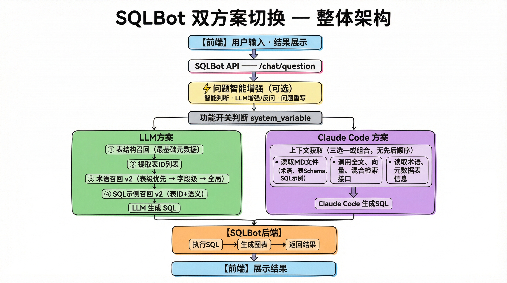
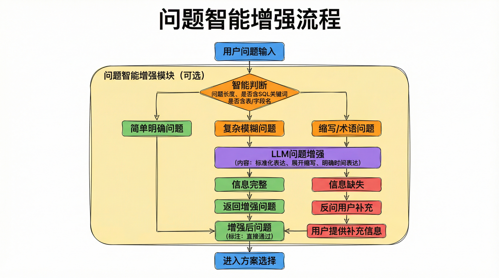

# SQLot 双方案切换详细设计文档

## 📋 文档信息

- **版本**：v6.0 (详细设计版）
- **创建日期**：2026-02-09
- **作者**：CodeCraft
- **状态**：待评审

---

## 📑 目录

1. [需求背景](#1-需求背景)
2. [设计原则](#2-设计原则)
3. [架构设计](#3-架构设计)
4. [数据库设计](#4-数据库设计)
5. [详细代码设计](#5-详细代码设计)
6. [实施计划](#6-实施计划)
7. [新建工程方案](#7-新建工程方案)
8. [测试方案](#8-测试方案)
9. [回滚方案](#9-回滚方案)
10. [方案对比总结](#10-方案对比总结)

---

## 1. 需求背景

### 1.1 业务需求

SQLBot当前使用LLM API生成SQL，需要支持Claude Code方案，并能在两种方案间灵活切换。

### 1.2 功能需求

- 支持两种SQL生成方案：LLM方案、Claude Code方案
- 通过功能开关动态切换方案
- Claude Code方案通过读取MD文件获取上下文
- SQLBot后端负责执行SQL、生成图表、返回结果
- 前端负责展示结果

### 1.3 非功能需求

- 平滑切换，无需重启服务
- 向后兼容，不影响现有功能
- 自动降级，Claude Code失败自动回退到LLM方案
- 最小化代码改动

---

## 2. 设计原则

### 2.1 架构原则

- **职责分离**：Claude Code生成SQL，SQLBot执行+图表，前端展示
- **策略模式**：通过工厂模式选择不同方案
- **依赖倒置**：依赖抽象接口而非具体实现
- **开闭原则**：对扩展开放，对修改封闭

### 2.2 技术原则

- **复用现有代码**：SQL执行、图表配置复用现有逻辑
- **零表结构变更**：复用 `system_variable`表存储配置
- **保持代码风格**：符合SQLBot现有FastAPI + SQLModel架构
- **最小改动**：API层只需几行代码

### 2.3 安全原则

- **配置隔离**：敏感信息不存储在MD文件中
- **权限控制**：功能开关配置需要管理员权限
- **降级机制**：Claude Code失败自动回退到LLM方案
- **日志审计**：记录方案切换和使用情况

---

## 3. 架构设计

### 3.1 整体架构



<details>
<summary>ASCII 版本（点击展开）</summary>

```

                              ┌─────────────────────────────────────┐
                              │           【前端】                    │
                              │  • 用户输入                          │
                              │  • 结果展示                          │
                              └─────────────────┬───────────────────┘
                                                │
                                                ▼
                              ┌─────────────────────────────────────┐
                              │       SQLBot API                    │
                              │    /chat/question                   │
                              └─────────────────┬───────────────────┘
                                                │
                                                ▼
                    ┌───────────────────────────────────────────────────────┐
                    │               问题智能增强 ⚡ (可选)                     │
                    │           claude_code_query_enhancement_enabled        │
                    │  • 智能判断  • LLM增强/反问  • 问题重写                   │
                    └─────────────────────────────┬─────────────────────────┘
                                                  │
                                                  ▼
                              ┌─────────────────────────────────────┐
                              │         功能开关判断                  │
                              │      system_variable                │
                              └─────────────┬───────────────────────┘
                                            │
                    ┌───────────────────────┴───────────────────────┐
                    │                                               │
                    ▼                                               ▼
        ┌───────────────────────┐                   ┌───────────────────────────┐
        │       LLM方案          │                   │      Claude Code 方案      │
        └───────────┬───────────┘                   └───────────────┬───────────┘
                    │                                               │
                    ▼                                               ▼
    ┌─────────────────────────────────────┐           ┌───────────────────────────────────────┐
    │        【SQLBot后端】三路召回         │           │          【Claude Code】                │
    ├─────────────────────────────────────┤           │  上下文获取 (三选一或组合，无先后顺序)   │
    │  ① 表结构召回 (最基础元数据)         │           │                                         │
    │           ↓                         │           │  • 读取MD文件 (术语、表Schema、SQL示例)  │
    │  ② 提取表ID列表                     │           │  • 调用全文、向量、混合检索接口           │
    │           ↓                         │           │  • 读取术语、元数据表信息                 │
    │  ③ 术语召回 v2                     │           └───────────────────┬─────────────────────┘
    │     基于表ID+语义                   │                               │
    │     • 表级术语 (优先)               │                               ▼
    │     • 字段级术语 (次要)             │           ┌───────────────────────────────────────┐
    │     • 全局术语 (补充)               │           │          【Claude Code】                │
    │           ↓                         │           │          生成SQL                       │
    │  ④ SQL示例召回 v2                  │           └───────────────────┬─────────────────────┘
    │     基于表ID+语义                   │                               │
    │           ↓                         │                               │
    │  【SQLBot后端】LLM生成SQL            │                               │
    └─────────────────┬───────────────────┘                               │
                      │                                                   │
                      └───────────────────────────┬───────────────────────┘
                                                │
                                                ▼
                    ┌─────────────────────────────────────────────────────────────┐
                    │                    【SQLBot后端】                              │
                    │  ┌─────────────┐  ┌─────────────┐  ┌─────────────┐          │
                    │  │  执行SQL    │→ │  生成图表   │→ │  返回结果   │          │
                    │  └─────────────┘  └─────────────┘  └──────┬──────┘          │
                    └───────────────────────────────────────────┼──────────────────┘
                                                                │
                                                                ▼
                                              ┌─────────────────────────────────────┐
                                              │           【前端】展示结果            │
                                              └─────────────────────────────────────┘
```

</details>

**召回流程说明 (LLM方案 - Phase 0优化)**:

1. **表结构召回**：先召回表结构（最基础的元数据）
2. **提取表ID**：从表结构中提取相关表ID列表
3. **术语召回 v2**：基于表ID + 问题语义召回术语
   - 优先：关联到这些表的术语 (`scope='table' AND table_ids && ?`)
   - 次要：关联到这些表字段的术语 (`scope='field' AND field_ids && ?`)
   - 补充：基于语义相似度的全局术语 (`scope='global'`)
4. **SQL示例召回 v2**：基于表ID + 问题语义召回SQL示例
   - 优先：关联到这些表的SQL示例 (`table_ids && ?`)
   - 次要：基于语义相似度的全局示例

**图注**:

- ⚡ **问题智能增强模块**：可配置开启/关闭，作用于两种方案
- ✅ **优化后的召回顺序**：表结构 → 术语/示例（基于表关联过滤），提升召回精准度
- 详见 [Phase 0: 召回顺序与关联优化](../roadmap.md#phase-0-召回顺序与关联优化-短期高优先级)

### 3.1.1 问题智能增强流程



<details>
<summary>ASCII 版本（点击展开）</summary>

```
┌─────────────────────────────────────────────────────────────────┐
│                   问题智能增强模块 (可选)                        │
├─────────────────────────────────────────────────────────────────┤
│                                                                 │
│  用户问题输入                                                    │
│     ↓                                                           │
│  ┌─────────────────┐                                           │
│  │ 智能判断         │                                           │
│  │ - 问题长度       │                                           │
│  │ - 是否含SQL关键词 │                                           │
│  │ - 是否含表/字段名 │                                           │
│  └────┬────────────┘                                           │
│       │                                                         │
│       ├──────────────┬──────────────┐                          │
│       ↓              ↓              ↓                          │
│   简单明确问题    复杂模糊问题    缩写/术语问题                   │
│       │              │              │                          │
│       │         ┌────┴──────────────┘                          │
│       │         ↓                                                 │
│       │    ┌─────────────────┐                                 │
│       │    │ LLM问题增强      │                                 │
│       │    │ - 标准化表达     │                                 │
│       │    │ - 展开缩写       │                                 │
│       │    │ - 明确时间表达   │                                 │
│       │    └────────┬────────┘                                 │
│       │             │                                           │
│       │             ├──────────────┐                           │
│       │             ↓              ↓                           │
│       │        信息完整      信息缺失                           │
│       │             │              │                           │
│       │             ↓              ↓                           │
│       │      返回增强问题    反问用户补充                        │
│       │             │              │                           │
│       └──────┬──────┘              │                           │
│              ↓                      ↓                           │
│         增强后问题          用户提供补充信息                     │
│              │                      │                           │
│              └──────────┬───────────┘                          │
│                         ↓                                       │
│                    进入方案选择                                  │
│                                                                 │
└─────────────────────────────────────────────────────────────────┘
```

</details>

**增强规则**:

1. **简单问题直接通过**：长度 ≥ 10字 或 包含明确的SQL关键词（与配置阈值一致）
2. **复杂问题智能增强**：含模糊时间词（"今年"、"最近"）需明确
3. **缩写自动映射**："DAU" → "日活跃用户数"，"GMV" → "成交总额"
4. **缺失信息主动反问**：聚合查询缺少分组维度时，反问用户

**配置开关**:

```sql
-- 是否启用问题增强
('claude_code_query_enhancement_enabled', 'boolean', 'custom', [false], NOW(), 1)

-- 增强复杂度阈值（字符数）
('claude_code_enhancement_threshold', 'number', 'custom', [10], NOW(), 1)

-- 是否允许反问用户
('claude_code_allow_followup', 'boolean', 'custom', [true], NOW(), 1)
```

### 3.2 目录结构

```
backend/apps/
├── chat/
│   ├── api/
│   │   └── chat.py              # 现有API（添加切换逻辑）
│   ├── task/
│   │   ├── __init__.py
│   │   ├── llm.py               # 现有LLM方案（保持不变）
│   │   ├── claude_code.py       # 新增：Claude Code方案
│   │   └── strategy_factory.py  # 新增：方案工厂
│   ├── models/
│   │   └── chat_model.py        # 现有模型
│   └── curd/
│       └── chat.py              # 现有CRUD
├── system/
│   ├── crud/
│   │   └── feature_flag.py      # 新增：功能开关CRUD
│   ├── api/
│   │   └── feature_flag.py      # 新增：功能开关API
│   └── models/
│       └── system_variable_model.py  # 现有（复用）
└── config_sync/
    ├── sync_config_to_md.py     # 现有配置同步
    └── claude_code_client.py    # 新增：Claude Code客户端

frontend/
├── src/
│   ├── components/
│   │   ├── ChatView.jsx         # 聊天视图（现有）
│   │   ├── SQLResult.jsx        # SQL结果展示（现有）
│   │   └── ChartView.jsx        # 图表展示（现有）
│   └── services/
│       └── chat.js              # 聊天服务（无需改动）

skills/
└── sqlbot-knowledge/
    ├── SKILL.md                 # Skill配置
    ├── SCHEMA.md                # 表结构（自动生成）
    ├── TERMINOLOGY.md           # 术语库（自动生成）
    ├── EXAMPLES.md              # SQL示例（自动生成）
    ├── PROMPT.md                # 自定义Prompt（自动生成）
    └── RELATIONS.md             # 表关系（自动生成）
```

### 3.3 三端职责

| 端                    | 职责                          |
| --------------------- | ----------------------------- |
| **Claude Code** | 读取MD文件 + 生成SQL          |
| **SQLBot后端**  | 执行SQL + 生成图表 + 返回结果 |
| **前端**        | 展示SQL、数据、图表           |

---

## 4. 数据库设计

### 4.1 使用现有 `system_variable`表

**表结构**：

```sql
CREATE TABLE system_variable (
    id BIGSERIAL PRIMARY KEY,
    name VARCHAR(128) NOT NULL,
    var_type VARCHAR(128) NOT NULL,
    type VARCHAR(128) NOT NULL,
    value JSONB,
    create_time TIMESTAMP,
    create_by BIGINT
);
```

### 4.2 功能开关配置

```sql
-- 功能开关配置
INSERT INTO system_variable (name, var_type, type, value, create_time, create_by)
VALUES
-- 1. SQL生成方案切换
('sql_solution_type', 'string', 'system', ['llm'], NOW(), 1),

-- 2. Claude Code Skill目录
('claude_code_skill_dir', 'string', 'custom',
 ['/Users/guchuan/codespace/SQLBot/skills/sqlbot-knowledge'], NOW(), 1),

-- 3. 是否自动同步配置到MD文件
('claude_code_sync_enabled', 'boolean', 'custom', [true], NOW(), 1),

-- 4. LLM方案是否启用RAG检索
('llm_rag_enabled', 'boolean', 'system', [true], NOW(), 1),

-- 5. Claude Code方案是否启用问题增强（可选）
('claude_code_query_enhancement_enabled', 'boolean', 'custom', [false], NOW(), 1),

-- 6. 问题增强复杂度阈值（字符数）
('claude_code_enhancement_threshold', 'number', 'custom', [10], NOW(), 1),

-- 7. 是否允许反问用户补充信息
('claude_code_allow_followup', 'boolean', 'custom', [true], NOW(), 1);
```

### 4.3 字段说明

| 变量名                                    | 类型    | 默认值          | 说明                                                      |
| ----------------------------------------- | ------- | --------------- | --------------------------------------------------------- |
| `sql_solution_type`                     | string  | 'llm'           | SQL生成方案：'llm'=LLM方案，'claude_code'=Claude Code方案 |
| `claude_code_skill_dir`                 | string  | /path/to/skills | Claude Code Skill目录                                     |
| `claude_code_sync_enabled`              | boolean | true            | 是否自动同步配置到MD文件                                  |
| `llm_rag_enabled`                       | boolean | true            | LLM方案是否启用RAG检索                                    |
| `claude_code_query_enhancement_enabled` | boolean | false           | **Claude Code方案是否启用问题增强**                 |
| `claude_code_enhancement_threshold`     | number  | 10              | 问题增强复杂度阈值（字符数），低于此值的问题会被增强      |
| `claude_code_allow_followup`            | boolean | true            | 是否允许反问用户补充信息                                  |

---

## 5. 详细代码设计

### 5.1 功能开关CRUD

**文件**：`backend/apps/system/crud/feature_flag.py`

```python
from typing import List
from sqlmodel import select
from apps.system.models.system_variable_model import SystemVariable
from common.core.deps import SessionDep, Trans


class FeatureFlagService:
    """功能开关服务"""

    @staticmethod
    def get_bool(session: SessionDep, name: str, default: bool = False) -> bool:
        """获取布尔类型的功能开关"""
        stmt = select(SystemVariable).where(SystemVariable.name == name)
        result = session.exec(stmt).first()
        if not result or not result.value:
            return default
        if result.var_type == 'boolean':
            return bool(result.value[0]) if result.value else default
        return default

    @staticmethod
    def get_string(session: SessionDep, name: str, default: str = '') -> str:
        """获取字符串类型的功能开关"""
        stmt = select(SystemVariable).where(SystemVariable.name == name)
        result = session.exec(stmt).first()
        if not result or not result.value:
            return default
        if result.var_type == 'string':
            return str(result.value[0]) if result.value else default
        return default

    @staticmethod
    def set_bool(session: SessionDep, name: str, value: bool, user_id: int = 1) -> bool:
        """设置布尔类型的功能开关"""
        import datetime
        stmt = select(SystemVariable).where(SystemVariable.name == name)
        result = session.exec(stmt).first()
        if result:
            result.value = [value]
            result.create_by = user_id
            session.add(result)
        else:
            variable = SystemVariable(
                name=name, var_type='boolean', type='custom',
                value=[value], create_time=datetime.datetime.now(), create_by=user_id
            )
            session.add(variable)
        session.commit()
        return True

    @staticmethod
    def set_string(session: SessionDep, name: str, value: str, user_id: int = 1) -> bool:
        """设置字符串类型的功能开关"""
        import datetime
        stmt = select(SystemVariable).where(SystemVariable.name == name)
        result = session.exec(stmt).first()
        if result:
            result.value = [value]
            result.create_by = user_id
            session.add(result)
        else:
            variable = SystemVariable(
                name=name, var_type='string', type='custom',
                value=[value], create_time=datetime.datetime.now(), create_by=user_id
            )
            session.add(variable)
        session.commit()
        return True

    @staticmethod
    def get_sql_solution_type(session: SessionDep) -> str:
        """获取当前SQL生成方案类型"""
        return FeatureFlagService.get_string(
            session,
            'sql_solution_type',
            default='llm'
        )

    @staticmethod
    def set_sql_solution_type(session: SessionDep, solution_type: str, user_id: int = 1) -> bool:
        """设置SQL生成方案类型"""
        if solution_type not in ['llm', 'claude_code']:
            raise ValueError(f"Invalid solution type: {solution_type}")
        return FeatureFlagService.set_string(
            session,
            'sql_solution_type',
            solution_type,
            user_id
        )

    @staticmethod
    def get_all(session: SessionDep, trans: Trans, keyword: str = None) -> List[SystemVariable]:
        """获取所有功能开关"""
        from sqlalchemy import and_
        if keyword:
            stmt = select(SystemVariable).where(
                and_(
                    SystemVariable.name.like(f'%{keyword}%'),
                    SystemVariable.var_type.in_(['boolean', 'string'])
                )
            )
        else:
            stmt = select(SystemVariable).where(
                SystemVariable.var_type.in_(['boolean', 'string'])
            )
        results = session.exec(stmt).all()
        return results
```

---

### 5.2 功能开关API

**文件**：`backend/apps/system/api/feature_flag.py`

```python
from typing import List, Optional
from fastapi import APIRouter, Query, HTTPException
from pydantic import BaseModel
from apps.system.models.system_variable_model import SystemVariable
from apps.system.crud.feature_flag import FeatureFlagService
from apps.swagger.i18n import PLACEHOLDER_PREFIX
from common.core.deps import SessionDep, CurrentUser, Trans

router = APIRouter(tags=["Feature Flags"], prefix="/system/feature-flags")


class ToggleFlagRequest(BaseModel):
    """切换开关请求"""
    name: str
    value: bool


class UpdateFlagRequest(BaseModel):
    """更新开关请求"""
    name: str
    value: str


@router.get("/list", summary=f"{PLACEHOLDER_PREFIX}get_feature_flags")
async def list_flags(
    session: SessionDep,
    trans: Trans,
    keyword: Optional[str] = Query(None, description="搜索关键词")
) -> List[SystemVariable]:
    """获取功能开关列表"""
    return FeatureFlagService.get_all(session, trans, keyword)


@router.get("/{name}", summary=f"{PLACEHOLDER_PREFIX}get_feature_flag")
async def get_flag(session: SessionDep, name: str) -> dict:
    """获取功能开关值"""
    # 先尝试获取boolean
    try:
        value = FeatureFlagService.get_bool(session, name)
        return {"name": name, "value": value, "type": "boolean"}
    except:
        pass

    # 再尝试获取string
    value = FeatureFlagService.get_string(session, name)
    return {"name": name, "value": value, "type": "string"}


@router.post("/toggle", summary=f"{PLACEHOLDER_PREFIX}toggle_feature_flag")
async def toggle_flag(
    session: SessionDep,
    current_user: CurrentUser,
    request: ToggleFlagRequest
) -> dict:
    """切换功能开关"""
    success = FeatureFlagService.set_bool(
        session,
        request.name,
        request.value,
        current_user.id
    )
    if not success:
        raise HTTPException(status_code=500, detail="切换失败")
    return {"name": request.name, "value": request.value, "success": True}


@router.post("/update", summary=f"{PLACEHOLDER_PREFIX}update_feature_flag")
async def update_flag(
    session: SessionDep,
    current_user: CurrentUser,
    request: UpdateFlagRequest
) -> dict:
    """更新功能开关"""
    success = FeatureFlagService.set_string(
        session,
        request.name,
        request.value,
        current_user.id
    )
    if not success:
        raise HTTPException(status_code=500, detail="更新失败")
    return {"name": request.name, "value": request.value, "success": True}


@router.post("/solution-type", summary=f"{PLACEHOLDER_PREFIX}set_solution_type")
async def set_solution_type(
    session: SessionDep,
    current_user: CurrentUser,
    solution_type: str
) -> dict:
    """设置SQL生成方案类型"""
    success = FeatureFlagService.set_sql_solution_type(
        session,
        solution_type,
        current_user.id
    )
    if not success:
        raise HTTPException(status_code=500, detail="设置失败")
    return {"solution_type": solution_type, "success": True}


@router.get("/solution-type", summary=f"{PLACEHOLDER_PREFIX}get_solution_type")
async def get_solution_type(session: SessionDep) -> dict:
    """获取当前SQL生成方案类型"""
    solution_type = FeatureFlagService.get_sql_solution_type(session)
    return {"solution_type": solution_type}
```

---

### 5.3 Claude Code客户端

**文件**：`backend/apps/config_sync/claude_code_client.py`

```python
import asyncio
import subprocess
import json
from typing import Dict, Any


class ClaudeCodeClient:
    """
    Claude Code客户端

    职责：
    1. 读取MD文件（SCHEMA.md, TERMINOLOGY.md, EXAMPLES.md, PROMPT.md）
    2. 生成SQL

    不负责：
    - 执行SQL（由SQLBot后端完成）
    - 生成图表（由SQLBot后端完成）
    - 返回数据（由SQLBot后端完成）
    - 展示结果（由前端完成）
    """

    def __init__(self, skill_dir: str = None, claude_path: str = "claude"):
        self.skill_dir = skill_dir or "/Users/guchuan/codespace/SQLBot/skills/sqlbot-knowledge"
        self.claude_path = claude_path

    async def generate_sql(self, question: str, **kwargs) -> Dict[str, Any]:
        """
        调用Claude Code生成SQL

        Claude Code会自动读取以下MD文件获取上下文：
        - SCHEMA.md：表结构
        - TERMINOLOGY.md：术语库
        - EXAMPLES.md：SQL示例
        - PROMPT.md：自定义Prompt

        Args:
            question: 用户问题
            **kwargs: 其他参数

        Returns:
            Dict: {'sql': str, 'chart_type': Optional[str], 'brief': Optional[str]}

        Raises:
            Exception: Claude Code调用失败
        """
        # 构建提示词
        prompt = f"""
你是SQLBot的智能问数Agent。请根据用户问题生成SQL。

用户问题：{question}

请自动读取以下配置文件获取上下文：
- {self.skill_dir}/SCHEMA.md（表结构）
- {self.skill_dir}/TERMINOLOGY.md（术语库）
- {self.skill_dir}/EXAMPLES.md（SQL示例）
- {self.skill_dir}/PROMPT.md（自定义Prompt）

要求：
1. 只生成SQL，不要解释
2. 使用COUNT(*)时，确保正确统计
3. 涉及术语时，使用字段精确匹配
4. 多表查询时，优先使用JOIN而非子查询

返回JSON格式：
{{
  "sql": "SELECT ...",
  "chart_type": "line|bar|pie|table",
  "brief": "简短描述"
}}
"""

        # 调用Claude Code
        result = await self._call_claude_code(prompt)

        # 解析结果
        return self._parse_sql_result(result)

    async def enhance_question(self, question: str) -> Dict[str, Any]:
        """
        问题智能增强（可选功能）

        在生成SQL之前对用户问题进行增强和标准化：
        - 标准化表达
        - 展开缩写/术语
        - 明确模糊的时间表达
        - 检测缺失信息并反问

        Args:
            question: 原始用户问题

        Returns:
            Dict: {
                'enhanced_question': str,      # 增强后的问题
                'needs_clarification': bool,   # 是否需要用户补充信息
                'clarification_question': str, # 反问用户的问题
                'detected_entities': list    # 识别出的实体
            }

        示例：
        输入: "今年卖了多少？"
        输出: {
            'enhanced_question': '查询今年的销售额总额',
            'needs_clarification': False,
            'clarification_question': None,
            'detected_entities': ['sales', 'amount', '2026']
        }

        输入: "销售额TOP10地区"
        输出: {
            'enhanced_question': '查询销售额TOP10地区',
            'needs_clarification': True,
            'clarification_question': '请问需要按哪段时间范围统计？',
            'detected_entities': ['sales', 'region', 'top10']
        }
        """
        prompt = f"""
你是SQLBot的问题分析助手。请分析以下用户问题并进行增强。

用户问题：{question}

请分析并返回JSON格式结果：
{{
  "enhanced_question": "增强后的问题（标准化表达）",
  "needs_clarification": true/false,
  "clarification_question": "如果需要补充信息，提供反问用户的问题",
  "detected_entities": ["识别出的表名", "字段名", "指标名等"]
}}

增强规则：
1. 保留原意
2. 明确模糊时间表达（如"今年" → "2026年"）
3. 展开业务缩写（如"DAU" → "日活跃用户数"）
4. 如果问题缺少关键信息（如时间范围、分组维度），设置 needs_clarification 为 true
5. 提供清晰的反问问题

只返回JSON，不要其他内容。
"""

        try:
            # 调用Claude Code进行问题分析
            result = await self._call_claude_code(prompt)

            # 解析结果
            return self._parse_enhancement_result(result)

        except Exception as e:
            # 增强失败时返回原问题
            return {
                'enhanced_question': question,
                'needs_clarification': False,
                'clarification_question': None,
                'detected_entities': []
            }

    def _parse_enhancement_result(self, result: str) -> Dict[str, Any]:
        """解析问题增强结果"""
        try:
            # 尝试提取JSON
            if '{' in result and '}' in result:
                start = result.find('{')
                end = result.rfind('}') + 1
                json_str = result[start:end]
                parsed = json.loads(json_str)

                # 确保返回所有必需字段
                return {
                    'enhanced_question': parsed.get('enhanced_question', result),
                    'needs_clarification': parsed.get('needs_clarification', False),
                    'clarification_question': parsed.get('clarification_question'),
                    'detected_entities': parsed.get('detected_entities', [])
                }
            else:
                raise ValueError("无法从结果中提取JSON")
        except Exception as e:
            # 如果解析失败，返回原问题
            return {
                'enhanced_question': result.strip(),
                'needs_clarification': False,
                'clarification_question': None,
                'detected_entities': []
            }

    async def _call_claude_code(self, prompt: str) -> str:
        """
        调用Claude Code（通过子进程）

        Args:
            prompt: 提示词

        Returns:
            str: Claude Code返回结果

        Raises:
            Exception: 调用失败
        """
        import tempfile

        # 创建临时文件存储提示词
        with tempfile.NamedTemporaryFile(mode='w', suffix='.txt', delete=False) as f:
            f.write(prompt)
            prompt_file = f.name

        try:
            # 调用Claude Code
            cmd = [
                self.claude_path,
                "ask",
                "-f", prompt_file,
                "--output", "json",
                "--cwd", self.skill_dir
            ]

            process = await asyncio.create_subprocess_exec(
                *cmd,
                stdout=asyncio.subprocess.PIPE,
                stderr=asyncio.subprocess.PIPE,
                cwd=self.skill_dir
            )

            stdout, stderr = await process.communicate()

            if process.returncode != 0:
                error_msg = stderr.decode('utf-8', errors='ignore')
                raise Exception(f"Claude Code执行失败: {error_msg}")

            result = stdout.decode('utf-8', errors='ignore')
            return result

        finally:
            # 删除临时文件
            import os
            if os.path.exists(prompt_file):
                os.remove(prompt_file)

    def _parse_sql_result(self, result: str) -> Dict[str, Any]:
        """解析SQL生成结果"""
        try:
            # 尝试提取JSON
            if '{' in result and '}' in result:
                start = result.find('{')
                end = result.rfind('}') + 1
                json_str = result[start:end]
                return json.loads(json_str)
            else:
                raise ValueError("无法从结果中提取JSON")
        except Exception as e:
            # 如果解析失败，返回纯文本
            return {
                "sql": result.strip(),
                "chart_type": "table",
                "brief": ""
            }

    async def sync_config(self, datasource_id: int = 1, oid: int = 1) -> bool:
        """
        同步配置到MD文件

        Args:
            datasource_id: 数据源ID
            oid: 组织ID

        Returns:
            bool: 是否成功
        """
        try:
            from apps.config_sync.sync_config_to_md import sync_all
            await asyncio.to_thread(sync_all, datasource_id, oid)
            return True
        except Exception as e:
            raise Exception(f"配置同步失败: {str(e)}")
```

---

### 5.4 Claude Code方案任务

**文件**：`backend/apps/chat/task/claude_code.py`

```python
import asyncio
import traceback
import json
from typing import AsyncIterator, Dict, Any
from sqlmodel import Session

from apps.chat.curd.chat import (
    save_question, save_sql_answer, save_chart_answer, get_chart_data
)
from apps.chat.models.chat_model import ChatQuestion, ChatRecord
from apps.config_sync.claude_code_client import ClaudeCodeClient
from apps.system.crud.feature_flag import FeatureFlagService
from common.core.deps import CurrentUser, CurrentAssistant
from common.error import SingleMessageError
from common.utils.locale import I18n, I18nHelper


class ClaudeCodeTask:
    """
    Claude Code方案任务

    职责：
    1. 调用Claude Code生成SQL
    2. SQLBot后端执行SQL
    3. SQLBot后端生成图表配置
    4. SQLBot后端返回结果

    不负责：
    - RAG检索（Claude Code会直接读取MD文件）
    - 展示结果（由前端完成）
    """

    def __init__(self, session: Session, current_user: CurrentUser,
                 chat_question: ChatQuestion, current_assistant: CurrentAssistant = None):
        self.session = session
        self.current_user = current_user
        self.chat_question = chat_question
        self.current_assistant = current_assistant
        self.record: ChatRecord = None
        self.client: ClaudeCodeClient = None

        # 国际化
        i18n = I18n()
        self.trans: I18nHelper = i18n(lang=current_user.language)

    async def create(self):
        """初始化Claude Code客户端"""
        # 获取配置
        skill_dir = FeatureFlagService.get_string(
            self.session,
            'claude_code_skill_dir',
            '/Users/guchuan/codespace/SQLBot/skills/sqlbot-knowledge'
        )

        # 创建客户端
        self.client = ClaudeCodeClient(skill_dir=skill_dir)

        # 检查是否需要同步配置
        sync_enabled = FeatureFlagService.get_bool(self.session, 'claude_code_sync_enabled', True)
        if sync_enabled:
            # 异步同步配置（不阻塞）
            asyncio.create_task(self._sync_config_async())

    async def _sync_config_async(self):
        """异步同步配置"""
        try:
            ds_id = self.chat_question.datasource_id
            if ds_id:
                oid = self.current_user.oid if self.current_assistant is None else self.current_assistant.oid
                await self.client.sync_config(datasource_id=ds_id, oid=oid)
        except Exception as e:
            # 同步失败不影响主流程
            print(f"[ClaudeCode] 配置同步失败: {e}")

    async def init_record(self) -> ChatRecord:
        """
        初始化聊天记录

        注意：这里不做RAG检索，因为Claude Code会直接读取MD文件
        """
        # 可选：问题增强（在调用Claude Code之前）
        if FeatureFlagService.get_bool(self.session, 'claude_code_query_enhancement_enabled', False):
            self.chat_question.question = await self._enhance_question(self.chat_question.question)

        self.record = save_question(
            session=self.session,
            current_user=self.current_user,
            question=self.chat_question
        )
        return self.record

    async def _enhance_question(self, question: str) -> str:
        """
        问题智能增强（可选功能）

        在调用Claude Code之前对用户问题进行增强：
        - 标准化表达
        - 展开缩写/术语
        - 明确模糊的时间表达

        Args:
            question: 原始用户问题

        Returns:
            str: 增强后的问题
        """
        # 智能判断是否需要增强
        if self._is_simple_question(question):
            return question

        # 调用Claude Code进行问题增强
        enhanced = await self.client.enhance_question(question)

        # 如果需要用户补充信息，返回反问
        if enhanced.get('needs_clarification'):
            self.chat_question.clarification_needed = True
            self.chat_question.clarification_question = enhanced.get('clarification_question')
            # 保存反问记录
            save_question(
                session=self.session,
                current_user=self.current_user,
                question=self.chat_question
            )
            raise SingleMessageError(enhanced.get('clarification_question'))

        return enhanced.get('enhanced_question', question)

    def _is_simple_question(self, question: str) -> bool:
        """
        判断是否为简单问题（不需要增强）

        简单问题特征：
        - 长度 ≥ 10字（与配置阈值一致）
        - 包含明确的表名/字段名
        - 包含明确的SQL关键词
        """
        # 简单规则判断
        if len(question) >= 10:
            return True

        # 包含明确的SQL关键词
        sql_keywords = ['SELECT', 'select', '查询', '统计', 'TOP', 'GROUP BY']
        if any(kw in question for kw in sql_keywords):
            return True

        return False

    async def generate_sql(self) -> AsyncIterator[Dict[str, Any]]:
        """
        生成SQL（由Claude Code完成）

        Yields:
            Dict: 流式返回的SQL生成结果
        """
        question = self.chat_question.question

        yield {
            'type': 'status',
            'content': self.trans('i18n_chat.generating_sql')
        }

        try:
            # 调用Claude Code生成SQL
            result = await self.client.generate_sql(question)

            sql = result.get('sql', '')
            chart_type = result.get('chart_type', 'table')
            brief = result.get('brief', '')

            if not sql:
                raise SingleMessageError(self.trans('i18n_chat.sql_generation_failed'))

            # 保存生成的SQL
            save_sql_answer(
                session=self.session,
                record_id=self.record.id,
                answer=f'{{"content": {sql}}}'
            )

            # 流式返回SQL
            yield {
                'type': 'sql',
                'content': sql,
                'chart_type': chart_type,
                'brief': brief
            }

        except Exception as e:
            traceback.print_exc()
            yield {
                'type': 'error',
                'content': str(e)
            }
            raise

    async def execute_sql(self, sql: str) -> AsyncIterator[Dict[str, Any]]:
        """
        执行SQL（由SQLBot后端完成）

        Args:
            sql: SQL语句

        Yields:
            Dict: 流式返回的执行结果
        """
        yield {
            'type': 'status',
            'content': self.trans('i18n_chat.executing_sql')
        }

        try:
            # 获取数据源
            from apps.datasource.crud.datasource import get_ds
            ds = get_ds(self.session, self.record.datasource)
            if not ds:
                raise SingleMessageError(self.trans('i18n_chat.datasource_not_found'))

            # 执行SQL（复用现有逻辑）
            from apps.db.db import exec_sql
            data, columns = await exec_sql(ds=ds, sql=sql)

            # 返回结果数据
            yield {
                'type': 'data',
                'content': {
                    'data': data,
                    'columns': columns
                }
            }

        except Exception as e:
            traceback.print_exc()
            yield {
                'type': 'error',
                'content': str(e)
            }
            raise

    async def generate_chart(self, chart_type: str = '', schema: str = '') -> AsyncIterator[Dict[str, Any]]:
        """
        生成图表配置（由SQLBot后端完成）

        Args:
            chart_type: 图表类型
            schema: 数据Schema

        Yields:
            Dict: 流式返回的图表配置
        """
        yield {
            'type': 'status',
            'content': self.trans('i18n_chat.generating_chart')
        }

        try:
            # 获取数据
            data = get_chart_data(self.session, self.record.id)

            # 生成图表配置（复用现有逻辑）
            chart_config = {
                "type": chart_type or "table",
                "data": data,
                "title": self.chat_question.question
            }

            # 保存图表配置
            save_chart_answer(
                session=self.session,
                record_id=self.record.id,
                answer=f'{{"content": {json.dumps(chart_config)}}}'
            )

            # 流式返回图表配置
            yield {
                'type': 'chart',
                'content': chart_config
            }

        except Exception as e:
            traceback.print_exc()
            yield {
                'type': 'error',
                'content': str(e)
            }
            raise

    async def run_task(self, in_chat: bool = True, stream: bool = True,
                       finish_step: str = 'generate_chart') -> AsyncIterator[Dict[str, Any]]:
        """
        运行完整任务流程

        Yields:
            Dict: 流式返回的结果
        """
        # 1. 生成SQL（Claude Code自动读取MD文件）
        async for chunk in self.generate_sql():
            yield chunk

            # 如果出错，停止
            if chunk.get('type') == 'error':
                return

            sql = chunk.get('content')

        # 2. 执行SQL（SQLBot后端完成）
        async for chunk in self.execute_sql(sql):
            yield chunk

            # 如果出错，停止
            if chunk.get('type') == 'error':
                return

        # 3. 生成图表配置（SQLBot后端完成）
        if finish_step == 'generate_chart':
            async for chunk in self.generate_chart():
                yield chunk

                # 如果出错，停止
                if chunk.get('type') == 'error':
                    return
```

---

### 5.5 策略工厂

**文件**：`backend/apps/chat/task/strategy_factory.py`

```python
from abc import ABC, abstractmethod
from typing import AsyncIterator, Dict, Any
from sqlmodel import Session

from apps.chat.models.chat_model import ChatQuestion
from apps.chat.task.llm import LLMService
from apps.chat.task.claude_code import ClaudeCodeTask
from apps.system.crud.feature_flag import FeatureFlagService
from common.core.deps import CurrentUser, CurrentAssistant


class BaseSQLGenerator(ABC):
    """SQL生成器基类（策略接口）"""

    def __init__(self, session: Session, chat_question: ChatQuestion,
                 current_user: CurrentUser, current_assistant: CurrentAssistant = None):
        self.session = session
        self.chat_question = chat_question
        self.current_user = current_user
        self.current_assistant = current_assistant
        self.record = None

    @abstractmethod
    async def create(self):
        """初始化生成器"""
        pass

    @abstractmethod
    async def init_record(self):
        """初始化记录"""
        pass

    @abstractmethod
    async def run_task(self, in_chat: bool = True, stream: bool = True,
                      finish_step: str = 'generate_chart') -> AsyncIterator[Dict[str, Any]]:
        """运行任务"""
        pass

    def get_record(self):
        """获取记录"""
        return self.record


class LLMSQLGenerator(BaseSQLGenerator):
    """LLM方案生成器（含RAG检索）"""

    def __init__(self, session: Session, chat_question: ChatQuestion,
                 current_user: CurrentUser, current_assistant: CurrentAssistant = None):
        super().__init__(session, chat_question, current_user, current_assistant)
        self.llm_service: LLMService = None

    async def create(self):
        """初始化LLM服务"""
        self.llm_service = await LLMService.create(
            self.session, self.current_user, self.chat_question, self.current_assistant
        )

    async def init_record(self):
        """初始化记录"""
        self.record = self.llm_service.init_record(self.session)

    async def run_task(self, in_chat: bool = True, stream: bool = True,
                      finish_step: str = 'generate_chart') -> AsyncIterator[Dict[str, Any]]:
        """运行LLM任务（含RAG）"""
        self.llm_service.run_task_async(in_chat=in_chat, stream=stream, finish_step=finish_step)

        # 等待结果
        async for chunk in self.llm_service.await_result():
            yield chunk


class ClaudeCodeSQLGenerator(BaseSQLGenerator):
    """Claude Code方案生成器（无RAG检索）"""

    def __init__(self, session: Session, chat_question: ChatQuestion,
                 current_user: CurrentUser, current_assistant: CurrentAssistant = None):
        super().__init__(session, chat_question, current_user, current_assistant)
        self.cc_task: ClaudeCodeTask = None

    async def create(self):
        """初始化Claude Code任务"""
        self.cc_task = ClaudeCodeTask(
            self.session, self.current_user, self.chat_question, self.current_assistant
        )
        await self.cc_task.create()

    async def init_record(self):
        """初始化记录"""
        self.record = await self.cc_task.init_record()

    async def run_task(self, in_chat: bool = True, stream: bool = True,
                      finish_step: str = 'generate_chart') -> AsyncIterator[Dict[str, Any]]:
        """运行Claude Code任务（无RAG）"""
        async for chunk in self.cc_task.run_task(in_chat, stream, finish_step):
            yield chunk


class SQLGeneratorFactory:
    """SQL生成器工厂（策略工厂）"""

    @staticmethod
    async def create(session: Session, chat_question: ChatQuestion,
                    current_user: CurrentUser, current_assistant: CurrentAssistant = None) -> BaseSQLGenerator:
        """
        根据功能开关创建对应的SQL生成器

        Args:
            session: 数据库会话
            chat_question: 聊天问题
            current_user: 当前用户
            current_assistant: 当前助手

        Returns:
            BaseSQLGenerator: SQL生成器实例
        """
        # 检查功能开关
        solution_type = FeatureFlagService.get_sql_solution_type(session)

        if solution_type == 'claude_code':
            # Claude Code方案
            generator = ClaudeCodeSQLGenerator(session, chat_question, current_user, current_assistant)
        else:
            # LLM方案（默认）
            generator = LLMSQLGenerator(session, chat_question, current_user, current_assistant)

        # 初始化生成器
        await generator.create()

        return generator
```

---

### 5.6 API改造

**文件**：`backend/apps/chat/api/chat.py`（修改部分）

```python
async def stream_sql(session: SessionDep, current_user: CurrentUser, request_question: ChatQuestion,
                     current_assistant: Optional[CurrentAssistant] = None, in_chat: bool = True,
                     stream: bool = True, finish_step: ChatFinishStep = ChatFinishStep.GENERATE_CHART,
                     embedding: bool = False):
    """
    流式生成SQL（修改版）

    使用工厂模式，根据功能开关选择方案
    """
    try:
        # 原代码：
        # llm_service = await LLMService.create(...)

        # 新代码：使用工厂创建SQL生成器
        from apps.chat.task.strategy_factory import SQLGeneratorFactory

        sql_generator = await SQLGeneratorFactory.create(
            session, current_user, request_question, current_assistant
        )

        # 初始化记录
        await sql_generator.init_record()

        # 运行任务
        sql_generator.run_task_async(in_chat=in_chat, stream=stream, finish_step=finish_step)

    except Exception as e:
        traceback.print_exc()

        if stream:
            def _err(_e: Exception):
                yield 'data:' + orjson.dumps({'content': str(_e), 'type': 'error'}).decode() + '\n\n'

            return StreamingResponse(_err(e), media_type="text/event-stream")
        else:
            return JSONResponse(
                content={'message': str(e)},
                status_code=500,
            )

    if stream:
        return StreamingResponse(sql_generator.await_result(), media_type="text/event-stream")
    else:
        res = sql_generator.await_result()
        raw_data = {}
        for chunk in res:
            if chunk:
                raw_data = chunk
        status_code = 200
        if not raw_data.get('success'):
            status_code = 500

        return JSONResponse(
            content=raw_data,
            status_code=status_code,
        )
```

---

## 6. 实施计划

### 6.1 实施阶段

#### Phase 1: 功能开关模块（2-3小时）

**目标**：实现功能开关的读写功能

**任务**：

1. 实现 `FeatureFlagService`
2. 实现功能开关API
3. 初始化数据库配置
4. 单元测试

**交付物**：

- `backend/apps/system/crud/feature_flag.py`
- `backend/apps/system/api/feature_flag.py`
- 单元测试报告

---

#### Phase 2: Claude Code客户端（3-4小时）

**目标**：实现Claude Code调用功能

**任务**：

1. 实现 `ClaudeCodeClient`
2. 实现子进程调用
3. 实现结果解析
4. 端到端测试

**交付物**：

- `backend/apps/config_sync/claude_code_client.py`
- 测试报告

---

#### Phase 3: Claude Code方案任务（2-3小时）

**目标**：实现Claude Code方案的任务流程

**任务**：

1. 实现 `ClaudeCodeTask`
2. 实现SQL生成、执行、图表生成
3. 实现错误处理和降级
4. 单元测试

**交付物**：

- `backend/apps/chat/task/claude_code.py`
- 单元测试报告

---

#### Phase 4: 策略工厂（2-3小时）

**目标**：实现策略模式和工厂

**任务**：

1. 实现 `BaseSQLGenerator`接口
2. 实现 `LLMSQLGenerator`
3. 实现 `ClaudeCodeSQLGenerator`
4. 实现 `SQLGeneratorFactory`
5. 单元测试

**交付物**：

- `backend/apps/chat/task/strategy_factory.py`
- 单元测试报告

---

#### Phase 5: API改造（2-3小时）

**目标**：改造现有API使用工厂模式

**任务**：

1. 修改 `chat.py`的 `stream_sql`函数
2. 测试切换逻辑
3. 测试流式返回
4. 集成测试

**交付物**：

- 修改后的 `backend/apps/chat/api/chat.py`
- 集成测试报告

---

#### Phase 6: 测试和优化（2-3小时）

**目标**：全面测试和性能优化

**任务**：

1. 端到端测试
2. 性能测试
3. 压力测试
4. 文档编写

**交付物**：

- 测试报告
- 性能报告
- 用户文档

---

**总计**：13-19小时

---

### 6.2 里程碑

| 里程碑              | 完成时间 | 交付物                   |
| ------------------- | -------- | ------------------------ |
| M1: 功能开关模块    | Day 1    | 功能开关CRUD + API       |
| M2: Claude Code集成 | Day 2    | Claude Code客户端 + 任务 |
| M3: 策略工厂        | Day 3    | 策略模式实现             |
| M4: API改造         | Day 4    | API切换逻辑              |
| M5: 测试验收        | Day 5    | 测试报告 + 文档          |

---

## 7. 新建工程方案

### 7.1 方案概述

为确保不影响原有功能，采用**分支开发 + 并行运行**的方式。

### 7.2 方案选择

**推荐方案**：**功能开关 + 最小改动**

- 复用现有代码库
- 通过功能开关控制
- 最小化代码改动
- 无需新建工程

**备选方案**：**新建分支**

```bash
# 1. 创建新分支
git checkout -b feature/claude-code-solution

# 2. 在新分支上开发
# ... 开发代码 ...

# 3. 测试完成后合并
git checkout main
git merge feature/claude-code-solution
```

**不推荐方案**：**新建独立工程**

- 会产生代码重复
- 维护成本高
- 不符合软件工程最佳实践

### 7.3 推荐方案详细步骤

#### Step 1: 备份现有代码

```bash
# 1. 备份数据库
pg_dump -U postgres -d sqlbot > /backup/sqlbot_backup_$(date +%Y%m%d).sql

# 2. 备份代码
cd /Users/guchuan/codespace/SQLBot
tar -czf /backup/sqlbot_code_$(date +%Y%m%d).tar.gz .

# 3. 记录当前git commit
git log -1 > /backup/git_commit_$(date +%Y%m%d).txt
```

#### Step 2: 创建功能分支

```bash
cd /Users/guchuan/codespace/SQLBot

# 创建新分支
git checkout -b feature/claude-code-solution

# 查看分支
git branch
```

#### Step 3: 开发新功能

在新分支上按照实施计划开发：

1. Phase 1: 功能开关模块
2. Phase 2: Claude Code客户端
3. Phase 3: Claude Code方案任务
4. Phase 4: 策略工厂
5. Phase 5: API改造

#### Step 4: 初始化数据库

```sql
-- 在开发环境数据库执行
INSERT INTO system_variable (name, var_type, type, value, create_time, create_by)
VALUES
('sql_solution_type', 'string', 'system', ['llm'], NOW(), 1),
('claude_code_skill_dir', 'string', 'custom',
 ['/Users/guchuan/codespace/SQLBot/skills/sqlbot-knowledge'], NOW(), 1),
('claude_code_sync_enabled', 'boolean', 'custom', [true], NOW(), 1),
('llm_rag_enabled', 'boolean', 'system', [true], NOW(), 1);
```

#### Step 5: 测试

```bash
# 1. 启动开发环境
cd /Users/guchuan/codespace/SQLBot/backend
python -m uvicorn main:app --reload --port 8001

# 2. 运行测试
pytest tests/

# 3. 手动测试
# 访问 http://localhost:8001/docs
# 测试API接口
```

#### Step 6: 切换方案测试

```sql
-- 测试切换到Claude Code方案
UPDATE system_variable
SET value = ['claude_code']
WHERE name = 'sql_solution_type';

-- 测试切换回LLM方案
UPDATE system_variable
SET value = ['llm']
WHERE name = 'sql_solution_type';
```

#### Step 7: 合并到主分支

```bash
# 1. 确保测试通过
pytest tests/

# 2. 提交代码
git add .
git commit -m "feat: 添加Claude Code方案支持"

# 3. 切换到主分支
git checkout main

# 4. 合并分支
git merge feature/claude-code-solution

# 5. 推送到远程
git push origin main

# 6. 删除功能分支
git branch -d feature/claude-code-solution
```

#### Step 8: 生产环境部署

```bash
# 1. 备份生产环境
pg_dump -U postgres -h prod-db -d sqlbot > /backup/sqlbot_prod_backup.sql

# 2. 拉取最新代码
cd /path/to/prod/SQLBot
git pull origin main

# 3. 更新依赖
pip install -r requirements.txt

# 4. 初始化功能开关
# 在生产数据库执行上面的SQL语句

# 5. 重启服务
systemctl restart sqlbot
# 或
supervisorctl restart sqlbot

# 6. 验证
curl http://localhost:8000/health
```

---

## 8. 测试方案

### 8.1 单元测试

**测试覆盖**：

- `FeatureFlagService`：所有方法
- `ClaudeCodeClient`：生成SQL、解析结果
- `ClaudeCodeTask`：SQL生成、执行、图表生成
- `SQLGeneratorFactory`：工厂创建逻辑

**测试工具**：pytest

### 8.2 集成测试

**测试场景**：

1. LLM方案完整流程
2. Claude Code方案完整流程
3. 方案切换
4. 降级机制

**测试工具**：pytest + TestClient

### 8.3 端到端测试

**测试场景**：

1. 用户提问 → LLM方案 → 返回结果
2. 用户提问 → Claude Code方案 → 返回结果
3. 方案切换 → 用户提问 → 返回结果
4. Claude Code失败 → 自动降级 → LLM方案

**测试工具**：Playwright / Selenium

### 8.4 性能测试

**测试指标**：

- LLM方案响应时间
- Claude Code方案响应时间
- 方案切换响应时间
- 并发性能

**测试工具**：locust / JMeter

### 8.5 回归测试

**测试内容**：

- 确保原有功能不受影响
- 确保前端展示正常
- 确保数据库操作正常

**测试工具**：pytest

---

## 9. 回滚方案

### 9.1 代码回滚

```bash
# 方法1: Git回滚
git revert HEAD
# 或
git reset --hard <commit-id>

# 方法2: 恢复备份
tar -xzf /backup/sqlbot_code_20260209.tar.gz
```

### 9.2 数据库回滚

```bash
# 恢复数据库备份
psql -U postgres -d sqlbot < /backup/sqlbot_backup_20260209.sql

# 或删除功能开关
DELETE FROM system_variable
WHERE name IN ('sql_solution_type', 'claude_code_skill_dir', 'claude_code_sync_enabled', 'llm_rag_enabled');
```

### 9.3 配置回滚

```sql
-- 恢复默认LLM方案
UPDATE system_variable
SET value = ['llm']
WHERE name = 'sql_solution_type';
```

### 9.4 服务回滚

```bash
# 重启服务
systemctl restart sqlbot

# 或回滚代码并重启
git checkout main
systemctl restart sqlbot
```

---

## 10. 方案对比总结

### 10.1 讨论历程

| 版本 | 时间            | 核心改进                                           |
| ---- | --------------- | -------------------------------------------------- |
| V1   | 初版            | 基础双方案切换                                     |
| V2   | 按SQLBot架构    | 复用 `system_variable`表                         |
| V3   | 增加RAG检索切换 | LLM方案用embedding，Claude Code用MD文件            |
| V4   | 职责明确        | Claude Code生成SQL，SQLBot执行+图表                |
| V5   | 三端职责明确    | Claude Code生成SQL，SQLBot执行+图表+返回，前端展示 |
| V6   | 详细设计        | 完整实施计划、测试方案、回滚方案                   |

### 10.2 最终方案

**方案名称**：SQLBot双方案切换（Claude Code方案 + LLM方案）

**核心特点**：

1. **三端职责明确**

   - Claude Code：读取MD + 生成SQL
   - SQLBot后端：执行SQL + 生成图表 + 返回结果
   - 前端：展示结果
2. **技术架构**

   - 策略模式 + 工厂模式
   - 功能开关动态切换
   - 最小化代码改动
3. **实施方式**

   - 功能分支开发
   - 零表结构变更
   - 向后兼容

### 10.3 方案对比

| 方案                       | 优势         | 劣势                   | 推荐指数   |
| -------------------------- | ------------ | ---------------------- | ---------- |
| V1: 基础双方案切换         | 架构清晰     | 需要新建表，代码改动大 | ⭐⭐⭐     |
| V2: 按SQLBot架构           | 复用现有表   | 未考虑RAG检索          | ⭐⭐⭐⭐   |
| V3: 增加RAG检索            | 职责清晰     | 职责划分不够明确       | ⭐⭐⭐⭐   |
| V4: 职责明确               | 职责明确     | 未强调前端职责         | ⭐⭐⭐⭐⭐ |
| **V5: 三端职责明确** | 职责完整明确 | 无                     | ⭐⭐⭐⭐⭐ |
| **V6: 详细设计**     | 完整实施方案 | 文档复杂               | ⭐⭐⭐⭐⭐ |

### 10.4 最终建议

**推荐方案**：V5 + V6

**理由**：

1. 三端职责完整明确
2. 完整的实施方案
3. 详细的测试和回滚方案
4. 最小化风险

---

## 附录

### A. 配置同步脚本

参考：`backend/apps/config_sync/sync_config_to_md.py`

### B. Skill文件结构

参考：`skills/sqlbot-knowledge/SKILL.md`

### C. API文档

参考：`backend/apps/chat/api/chat.py`

---

**文档版本**：v6.0
**最后更新**：2026-02-09
**作者**：CodeCraft
