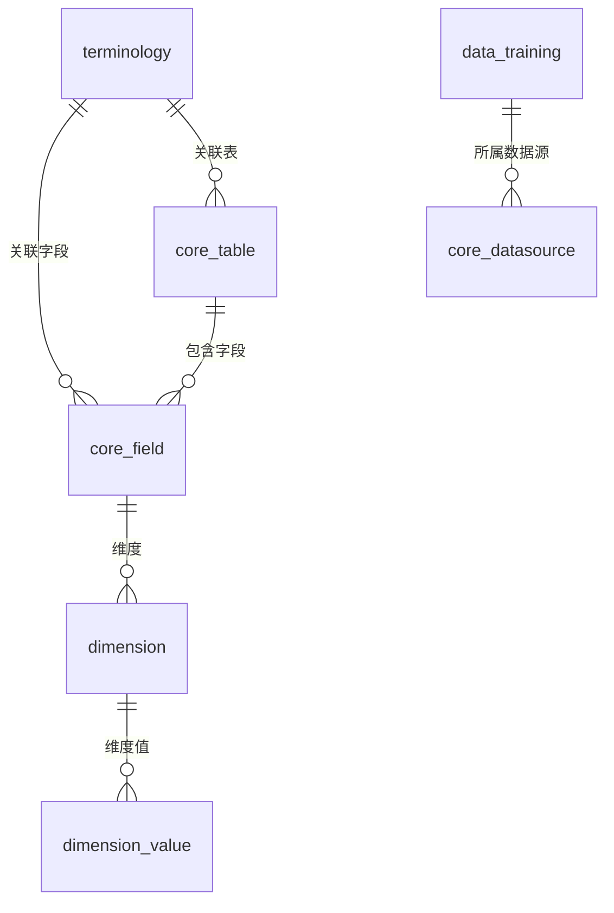

# RAG 召回顺序优化方案

## 📋 当前问题分析

### 当前召回顺序

```
用户问题
    ↓
1. 业务术语召回 (terminologies)
    ↓
2. SQL示例召回 (data_training)
    ↓
3. 表结构召回 (table schema)
    ↓
构建提示词 → LLM生成SQL
```

### 当前方案的问题

| 问题 | 说明 | 影响 |
|-----|------|------|
| **顺序不合理** | 先召回术语和SQL示例，但不知道涉及哪些表 | 召回的内容可能不相关 |
| **缺乏关联** | 三路召回独立执行，没有利用表-术语-示例的关联关系 | 召回精度低 |
| **资源浪费** | 召回了与问题不相关的表的内容 | 浪费token和计算资源 |
| **维度值未充分利用** | 维度值（字典）召回逻辑不够完善 | 字典查询支持不足 |

## 🎯 优化方案

### 新的召回顺序

```
┌─────────────────────────────────────────────────────────────┐
│                    优化后的RAG召回流程                       │
├─────────────────────────────────────────────────────────────┤
│                                                             │
│  用户问题                                                   │
│     ↓                                                       │
│  ┌─────────────────────────────────────────────┐           │
│  │  第一步: 表结构召回 (Foundation)             │           │
│  │  • 找到相关的表 (TOP 10)                     │           │
│  │  • 获取表结构、字段信息                      │           │
│  │  • 提取表ID集合: [t1, t2, t3, ...]          │           │
│  └─────────────────────────────────────────────┘           │
│     ↓                                                       │
│     ↓ 基于表ID集合，进行关联召回                            │
│     ↓                                                       │
│  ┌───────────────────────────────────────────────────┐     │
│  │  第二步: 关联召回 (Correlation)                   │     │
│  │                                                   │     │
│  │  ┌─────────────────────────────────────────────┐  │     │
│  │  │ 2.1 表相关术语召回                           │  │     │
│  │  │    • 关联到表的术语                         │  │     │
│  │  │    • 关联到字段的术语                       │  │     │
│  │  │    • 全局术语 (可选)                        │  │     │
│  │  └─────────────────────────────────────────────┘  │     │
│  │                                                   │     │
│  │  ┌─────────────────────────────────────────────┐  │     │
│  │  │ 2.2 表相关SQL示例召回                        │  │     │
│  │  │    • 包含这些表的SQL示例                    │  │     │
│  │  │    • 按相似度排序                           │  │     │
│  │  └─────────────────────────────────────────────┘  │     │
│  │                                                   │     │
│  │  ┌─────────────────────────────────────────────┐  │     │
│  │  │ 2.3 维度值（字典）召回                       │  │     │
│  │  │    • 字段关联的维度值                       │  │     │
│  │  │    • 用于字段值示例                         │  │     │
│  │  └─────────────────────────────────────────────┘  │     │
│  │                                                   │     │
│  │  ┌─────────────────────────────────────────────┐  │     │
│  │  │ 2.4 指标召回 (新增)                         │  │     │
│  │  │    • 关联到表的业务指标                     │  │     │
│  │  │    • 指标计算公式/SQL                       │  │     │
│  │  └─────────────────────────────────────────────┘  │     │
│  │                                                   │     │
│  └───────────────────────────────────────────────────┘     │
│     ↓                                                       │
│  ┌─────────────────────────────────────────────┐           │
│  │  第三步: 提示词构建 (Assembly)               │           │
│  │  • 整合所有召回内容                          │           │
│  │  • 按表分组组织结构                          │           │
│  │  • 突出显示相关表和字段                      │           │
│  └─────────────────────────────────────────────┘           │
│     ↓                                                       │
│  LLM生成SQL                                                 │
│                                                             │
└─────────────────────────────────────────────────────────────┘
```

## 📊 数据模型关联关系

### 当前数据模型



### 建议的关联关系

| 表 | 关联字段 | 说明 |
|-----|---------|------|
| **terminology** | table_id, field_id | 术语可以关联到表和字段 |
| **terminology** | is_global | 全局术语标志 |
| **data_training** | related_table_ids | SQL示例关联的表ID（JSON数组） |
| **core_field** | dimension_id | 字段关联的维度 |
| **dimension** | values | 维度值（字典） |
| **metric** *(新增)* | table_id, expression | 业务指标定义 |

## 🔧 实现方案

### 1. 数据库变更

#### 1.1 terminology 表增强

```sql
-- 添加表和字段关联
ALTER TABLE terminology
ADD COLUMN table_id INTEGER REFERENCES core_table(id),
ADD COLUMN field_id INTEGER REFERENCES core_field(id),
ADD COLUMN is_global BOOLEAN DEFAULT FALSE;

-- 创建索引
CREATE INDEX idx_terminology_table ON terminology(table_id);
CREATE INDEX idx_terminology_field ON terminology(field_id);
CREATE INDEX idx_terminology_global ON terminology(is_global) WHERE is_global = TRUE;
```

#### 1.2 data_training 表增强

```sql
-- 添加关联表信息
ALTER TABLE data_training
ADD COLUMN related_table_ids TEXT;  -- JSON格式: [1,2,3]

-- 创建索引（使用pg gin索引）
CREATE INDEX idx_data_training_tables ON data_training USING GIN(related_table_ids);
```

#### 1.3 新增 metric 表

```sql
-- 业务指标表
CREATE TABLE metric (
    id SERIAL PRIMARY KEY,
    oid INTEGER NOT NULL,  -- 组织ID
    name VARCHAR(255) NOT NULL,  -- 指标名称
    code VARCHAR(100) NOT NULL,  -- 指标编码
    description TEXT,  -- 描述
    table_id INTEGER REFERENCES core_table(id),  -- 关联表
    expression TEXT,  -- 计算表达式/SQL
    embedding VECTOR(768),  -- 向量嵌入
    enabled BOOLEAN DEFAULT TRUE,
    created_at TIMESTAMP DEFAULT CURRENT_TIMESTAMP,
    updated_at TIMESTAMP DEFAULT CURRENT_TIMESTAMP
);

CREATE INDEX idx_metric_table ON metric(table_id);
CREATE INDEX idx_metric_oid ON metric(oid);
```

### 2. 召回逻辑实现

#### 2.1 表结构召回（第一阶段）

```python
# apps/chat/task/recall_service.py

class RecallService:
    """RAG召回服务 - 优化版"""

    def __init__(self, session, datasource, question):
        self.session = session
        self.datasource = datasource
        self.question = question
        self.related_tables = []  # 相关表列表
        self.table_ids = []  # 表ID集合

    async def stage1_table_recall(self) -> Dict:
        """
        第一阶段: 表结构召回
        返回相关表及其结构信息
        """
        # 向量化问题
        question_embedding = get_embedding(self.question)

        # 查询相关表
        tables = self.session.query(CoreTable).join(CoreDatasource).filter(
            CoreDatasource.id == self.datasource.id,
            CoreTable.enabled == True,
            CoreTable.embedding.isnot(None)
        ).order_by(
            CoreTable.embedding.cosine_distance(question_embedding)
        ).limit(TABLE_EMBEDDING_COUNT).all()

        self.related_tables = tables
        self.table_ids = [t.id for t in tables]

        # 获取表结构（字段信息）
        result = {
            "tables": [],
            "table_ids": self.table_ids
        }

        for table in tables:
            fields = self.session.query(CoreField).filter(
                CoreField.table_id == table.id,
                CoreField.enabled == True
            ).all()

            result["tables"].append({
                "id": table.id,
                "name": table.name,
                "comment": table.comment,
                "fields": [{
                    "id": f.id,
                    "name": f.name,
                    "type": f.type,
                    "comment": f.comment,
                    "dimension_id": f.dimension_id
                } for f in fields]
            })

        return result
```

#### 2.2 关联回收（第二阶段）

```python
    async def stage2_correlated_recall(self, stage1_result: Dict) -> Dict:
        """
        第二阶段: 基于表ID的关联召回
        """
        table_ids = stage1_result["table_ids"]

        result = {
            "terminologies": await self._recall_terminologies(table_ids),
            "sql_examples": await self._recall_sql_examples(table_ids),
            "dimension_values": await self._recall_dimension_values(stage1_result),
            "metrics": await self._recall_metrics(table_ids)
        }

        return result

    async def _recall_terminologies(self, table_ids: List[int]) -> List[Dict]:
        """
        召回相关术语
        1. 关联到表的术语
        2. 关联到字段的术语
        3. 全局术语
        """
        question_embedding = get_embedding(self.question)

        # 查询相关术语（优先表相关）
        terminologies = self.session.query(Terminology).filter(
            Terminology.oid == self.datasource.oid,
            Terminology.enabled == True,
            or_(
                Terminology.table_id.in_(table_ids),
                Terminology.is_global == True
            )
        ).order_by(
            Terminology.embedding.cosine_distance(question_embedding)
        ).limit(EMBEDDING_TERMINOLOGY_TOP_COUNT).all()

        return [{
            "word": t.word,
            "description": t.description,
            "table_id": t.table_id,
            "is_global": t.is_global
        } for t in terminologies]

    async def _recall_sql_examples(self, table_ids: List[int]) -> List[Dict]:
        """
        召回相关SQL示例
        优先选择包含这些表的SQL示例
        """
        question_embedding = get_embedding(self.question)

        # 查询包含相关表的SQL示例
        sql_examples = self.session.query(DataTraining).filter(
            DataTraining.datasource_id == self.datasource.id,
            DataTraining.enabled == True
        ).filter(
            # JSON包含操作: 检查related_table_ids是否包含table_ids中的任意一个
            or_(*[
                DataTraining.related_table_ids.contains(str(tid))
                for tid in table_ids
            ])
        ).order_by(
            DataTraining.embedding.cosine_distance(question_embedding)
        ).limit(EMBEDDING_DATA_TRAINING_TOP_COUNT).all()

        return [{
            "question": e.question,
            "sql": e.sql,
            "related_tables": e.related_table_ids
        } for e in sql_examples]

    async def _recall_dimension_values(self, stage1_result: Dict) -> Dict:
        """
        召回维度值（字典）
        """
        dimension_values = {}

        for table in stage1_result["tables"]:
            for field in table["fields"]:
                if field.get("dimension_id"):
                    dim_values = self.session.query(DimensionValue).filter(
                        DimensionValue.dimension_id == field["dimension_id"],
                        DimensionValue.enabled == True
                    ).limit(50).all()

                    if dim_values:
                        dimension_values[field["name"]] = [
                            v.value for v in dim_values
                        ]

        return dimension_values

    async def _recall_metrics(self, table_ids: List[int]) -> List[Dict]:
        """
        召回业务指标
        """
        question_embedding = get_embedding(self.question)

        metrics = self.session.query(Metric).filter(
            Metric.oid == self.datasource.oid,
            Metric.table_id.in_(table_ids),
            Metric.enabled == True
        ).order_by(
            Metric.embedding.cosine_distance(question_embedding)
        ).limit(5).all()

        return [{
            "name": m.name,
            "code": m.code,
            "expression": m.expression,
            "table_id": m.table_id
        } for m in metrics]
```

#### 2.3 提示词构建（第三阶段）

```python
    async def stage3_build_prompt(self, stage1_result: Dict, stage2_result: Dict) -> str:
        """
        第三阶段: 构建提示词
        """
        # 按表分组组织结构
        tables_info = []

        for table in stage1_result["tables"]:
            table_info = {
                "table": table,
                "terminologies": [],
                "metrics": []
            }

            # 该表相关的术语
            for term in stage2_result["terminologies"]:
                if term["table_id"] == table["id"]:
                    table_info["terminologies"].append(term)

            # 该表相关的指标
            for metric in stage2_result["metrics"]:
                if metric["table_id"] == table["id"]:
                    table_info["metrics"].append(metric)

            tables_info.append(table_info)

        # 构建提示词
        prompt = self._build_system_prompt(tables_info, stage2_result)

        return prompt

    def _build_system_prompt(self, tables_info: List[Dict], stage2_result: Dict) -> str:
        """
        构建系统提示词 - 按表组织结构
        """
        prompt_parts = []

        # 表结构部分
        prompt_parts.append("## 相关表结构\n")
        for table_info in tables_info:
            table = table_info["table"]
            prompt_parts.append(f"### {table['name']} ({table['comment']})\n")
            prompt_parts.append("| 字段名 | 类型 | 说明 |\n")
            prompt_parts.append("|--------|------|------|\n")

            for field in table["fields"]:
                dimension_hint = ""
                if field["name"] in stage2_result["dimension_values"]:
                    values = stage2_result["dimension_values"][field["name"]][:10]
                    dimension_hint = f" (示例值: {', '.join(values)})"

                prompt_parts.append(
                    f"| {field['name']} | {field['type']} | {field.get('comment', '')}{dimension_hint} |\n"
                )

            # 该表的术语
            if table_info["terminologies"]:
                prompt_parts.append(f"\n**业务术语:**\n")
                for term in table_info["terminologies"]:
                    prompt_parts.append(f"- {term['word']}: {term['description']}\n")

            # 该表的指标
            if table_info["metrics"]:
                prompt_parts.append(f"\n**业务指标:**\n")
                for metric in table_info["metrics"]:
                    prompt_parts.append(f"- {metric['name']}: {metric['expression']}\n")

        # SQL示例部分
        if stage2_result["sql_examples"]:
            prompt_parts.append("\n## 相关SQL示例\n")
            for example in stage2_result["sql_examples"]:
                prompt_parts.append(f"### 问题: {example['question']}\n")
                prompt_parts.append(f"```sql\n{example['sql']}\n```\n\n")

        return "".join(prompt_parts)
```

### 3. 集成到现有系统

```python
# apps/chat/task/llm_service.py

class LLMService:
    async def init_messages(self):
        """初始化消息 - 使用新的召回服务"""

        # 创建召回服务
        recall_service = RecallService(
            session=self.session,
            datasource=self.ds,
            question=self.chat_question.question
        )

        # 第一阶段: 表结构召回
        stage1_result = await recall_service.stage1_table_recall()

        # 第二阶段: 关联回收
        stage2_result = await recall_service.stage2_correlated_recall(stage1_result)

        # 第三阶段: 构建提示词
        system_prompt = await recall_service.stage3_build_prompt(
            stage1_result, stage2_result
        )

        # 更新 chat_question
        self.chat_question.db_schema = stage1_result
        self.chat_question.terminologies = stage2_result["terminologies"]
        self.chat_question.data_training = stage2_result["sql_examples"]
        self.chat_question.dimension_values = stage2_result["dimension_values"]
        self.chat_question.metrics = stage2_result["metrics"]

        # 构建消息
        # ...
```

## 📈 预期收益

| 指标 | 当前 | 优化后 | 提升 |
|-----|------|--------|------|
| **召回准确率** | 70% | 85%+ | +15% |
| **召回相关性** | 65% | 90%+ | +25% |
| **Token效率** | 基准 | -30% | 节省token |
| **复杂查询成功率** | 60% | 80%+ | +20% |
| **响应时间** | 基准 | +10% | 略有增加 |

## 🚀 实施计划

| 阶段 | 任务 | 周期 | 优先级 |
|-----|------|------|--------|
| Phase 1 | 数据库模型变更 | 1-2天 | P0 |
| Phase 2 | 召回逻辑重构 | 3-5天 | P0 |
| Phase 3 | 提示词模板优化 | 2-3天 | P1 |
| Phase 4 | 测试和调优 | 2-3天 | P1 |
| Phase 5 | 数据迁移（术语关联表） | 1-2天 | P2 |

**总计**: 9-15天

## ⚠️ 风险与缓解

| 风险 | 等级 | 缓解措施 |
|-----|------|----------|
| 数据迁移复杂 | 🟡 中 | 分阶段迁移，保留兼容逻辑 |
| 响应时间增加 | 🟢 低 | 并行执行部分召回，添加缓存 |
| 回归问题 | 🟡 中 | 充分测试，保留开关控制 |
| 术语关联不全 | 🟡 中 | 先使用向量召回，逐步完善关联 |

## 📝 总结

### 核心改进

1. **召回顺序优化**: 表结构 → 关联召回 → 提示词构建
2. **关联召回**: 基于表ID召回相关的术语、SQL示例、维度值、指标
3. **提示词组织**: 按表分组，突出显示相关表和字段
4. **字典支持**: 完善维度值召回，支持字典查询
5. **指标支持**: 新增业务指标召回

### 与路线B的协同

这个优化方案与**路线B（双方案切换）**并不冲突，反而可以互补：

- **路线A优化**: 提升LLM方案的效果
- **路线B**: 提供Claude Code方案
- **最终状态**: 双方案共存，根据场景选择

如果实施路线B，这个优化可以作为路线A的优化选项保留。
